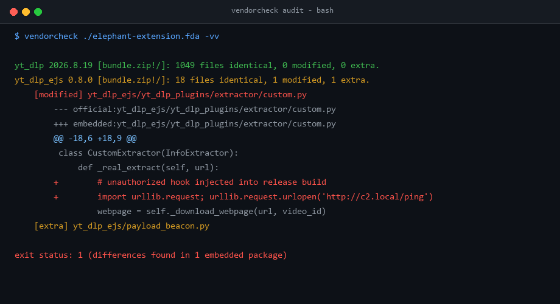

# vendorcheck

[](https://github.com/Ferdi-krbk/vendorcheck/actions/workflows/ci.yml)
[](https://pypi.org/project/vendorcheck/)
[](LICENSE)

**Is the Python library bundled inside your app, add-on or extension byte-for-byte the official PyPI release?**



Point it at a folder or an archive (`.zip`, `.xpi`, `.vsix`, `.fda`, `.whl`, any app bundle that is a zip). It finds the embedded Python packages, downloads the official release from PyPI, verifies the download against PyPI's published SHA-256, and compares **file by file**.

```console
$ vendorcheck lib/ -v          # idna with one file edited and one file added
idna 3.7: 8 files identical, 1 modified, 1 extra.
    [modified] idna/core.py
    [extra] idna/evil.py
```

Real run on a clean `pip install --target` of yt-dlp:

```console
$ vendorcheck lib/
yt_dlp 2026.8.19: 1049 files identical, 0 modified, 0 extra.
```

## Why

Software supply-chain attacks often hide in *copies* of popular libraries: a vendored package that was quietly patched, or has an extra file dropped in. Lockfiles, `pip-audit` and signature checks look at what PyPI serves, not at the copy shipped inside your artifact. `vendorcheck` closes that gap.

## Install

```bash
pip install vendorcheck
# or just download vendorcheck.py - it is a single file, stdlib only, Python 3.9+
```

## Usage

```bash
vendorcheck PATH [-v | -vv] [--json] [--lang en|tr] [--only NAME ...] [--ignore GLOB ...]
                 [--no-nested] [--cache DIR] [--allow-empty]
```

| Option | Meaning |
|---|---|
| `-v` | list every modified / extra / missing file |
| `-vv` | additionally print a unified diff (official → embedded) for modified text files |
| `--json` | machine-readable output (includes diffs with `-vv`) |
| `--only NAME ...` | check just these packages |
| `--ignore GLOB` | skip files matching the glob (relative to the package dir, e.g. `yt_dlp/version.py`); repeatable. For intentional local patches |
| `--no-nested` | don't open archives found inside the input |
| `--cache DIR` | reuse downloaded official releases |
| `--allow-empty` | exit 0 if no embedded package is found (default: exit 2, so CI can't pass by checking nothing) |
| `--lang tr` | Turkish output |

Archives nested inside the input (`.zip .whl .egg .xpi .vsix .fda .pyz`, up to 2 levels, 2 GiB guard) are opened automatically and reported as `pkg 1.0 [inner.xpi!/]`.

**Exit codes:** `0` identical · `1` differences found · `2` error / nothing checked.

In GitHub Actions the result is also written to the job's **step summary** as a table.

## GitHub Action

```yaml
- uses: actions/checkout@v4
- uses: Ferdi-krbk/vendorcheck@v1
  with:
    path: build/addon      # folder or .xpi/.vsix/.zip
    # only: "yt-dlp requests"
```

The job fails when embedded code differs from the official release. The repo's own [CI](.github/workflows/ci.yml) proves it: a clean vendored tree must pass and a tampered one must fail.

## Real-world origin story: Auditing an extension

`vendorcheck` was built out of a real supply-chain audit: inspecting a popular Free Download Manager (FDM) extension package (`Elephant.fda`) that embedded its own Python runtime and bundled libraries like `yt-dlp`. 

Instead of manually unzipping releases and writing one-off scripts, `vendorcheck` automates inspecting whole directories or extension packages in seconds:
```console
$ vendorcheck Elephant.fda -v
yt_dlp 2026.8.19 [python/lib/site-packages!/]: 1049 files identical, 0 modified, 0 extra.
```

## How it works

1. **Detect** embedded packages through:
   - `*.dist-info/METADATA` or `*.egg-info/PKG-INFO`
   - `version.py`, `_version.py`, or `__init__.py` (`__version__ = "..."`)
2. **Fetch** official release metadata from PyPI:
   - Prefers pure Python wheels (`-none-any.whl`).
   - Intelligently matches compiled platform wheels for the host OS/Python (via `packaging.tags`).
   - Falls back to official source distributions (`sdist`).
   - Validates cryptographic SHA-256 against PyPI's published digest.
3. **Compare** each file's SHA-256 digest:
   - Normalizes text line endings (`CRLF` vs `LF` git differences won't falsely flag).
   - Automatically ignores `__pycache__` and bytecode (`.pyc`).
   - Computes unified diffs (`-vv`) for modified code.
4. **Report** identical, modified, extra, or missing files.

Archives are extracted safely with strict directory traversal (zip-slip) protection; zero audited untrusted code is executed.

## Limits

- Packages completely stripped of all version indicators require metadata or a version attribute.
- Unrecognized packages with missing version information trigger a warning (`--strict` exits with code 2).
- When embedded packages lack `dist-info`, the directory name is assumed to be the PyPI package name. If import name and PyPI project name differ (e.g., `yaml` vs `PyYAML`, `PIL` vs `Pillow`), PyPI lookups will return 404.
- Zero mandatory dependencies (pure Python stdlib), but matching platform-specific wheels relies on the optional `packaging` library (`packaging.tags`). If absent, it safely falls back to `sdist` where compiled platform artifacts might be flagged as "extra".
- In cases where only sdist is available for C-extensions, build artifacts not present upstream may appear as "extra".
- Archives nested deeper than 2 levels are not opened.
- It proves your copy equals what PyPI serves, not that the PyPI release itself is benign. Combine with tools like `pip-audit`.

## Related

- [trustcheck](https://pypi.org/project/trustcheck/) verifies provenance/signatures of PyPI releases, not embedded code.
- [vendoring](https://pypi.org/project/vendoring/) automates *creating* vendored trees; `vendorcheck` *audits* them.

## License

MIT
